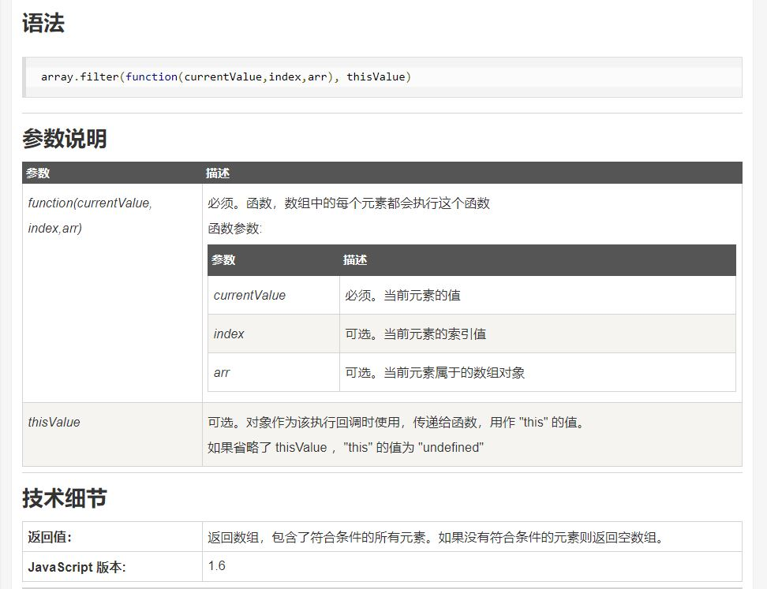

## 1.显示过滤：

<p style='margin-bottom:50px'></p>

HTML:
```html
    <div id='app'>
      //注意此处v-for循环的是filterNumber的方法名，所以循环的是
      //计算属性中filterNumber方法过滤后数组 
      <li v-for='n in filterNumber'> {{ n }} </li>
    </div>
```

Javascript:
```javascript

  var vm = new Vue({
    el: '#app',
    data: {
      numbers: [ 23, 45, 66, 99, 234, 2345 ]
    },
    
    computed: {
      filterNumber: function () {
        
        //
        return this.numbers.filter(function(numb){
          return numb % 3 === 0
        })
      } 
    }
  })

```

## js的`.filter()`语法：


